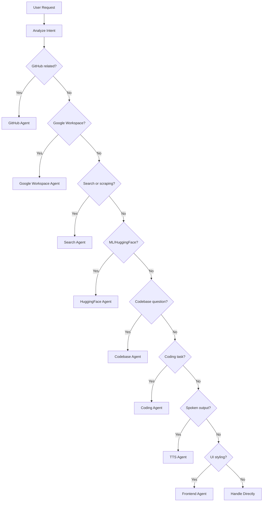

The MainAgent serves as the central orchestrator in the Multi-Agent AI Framework. It analyzes user requests and delegates tasks to specialized sub-agents.

## Overview

| Property | Value |
|----------|-------|
| **ID** | `main-agent` |
| **Default Model** | `gemini-2.5-flash` |
| **Provider** | Google |
| **Type** | Orchestrator |

## Capabilities

- **Task Analysis**: Understands user intent and determines the best agent to handle requests
- **Delegation**: Routes tasks to specialized agents (GitHub, Google Workspace, Search, Coding, etc.)
- **General Chat**: Handles conversations that don't require specialized tools
- **Context Management**: Maintains conversation context across agent switches

## Example Prompts

<AccordionGroup>
  <Accordion title="General Query">
    "What is Model Context Protocol?"
    
    MainAgent handles this directly without delegation.
  </Accordion>
  <Accordion title="GitHub Task">
    "Get the last two commits from Evangeline repo owner is oruccakir"
    
    Delegates to GitHubAgent for repository access.
  </Accordion>
  <Accordion title="Web Task">
    "Search this link oruccakir.live"
    
    Delegates to SearchAgent for content extraction.
  </Accordion>
  <Accordion title="Coding Task">
    "Write a Python function to normalize an array of scores."

    Delegates to Coding Agent for implementation.
  </Accordion>
  <Accordion title="Codebase Task">
    "Where is the database schema defined in this repo?"

    Delegates to Codebase Agent for codebase retrieval.
  </Accordion>
</AccordionGroup>

## Delegation Logic

The MainAgent uses intent classification to route requests:



## Configuration

```typescript
export const MainAgentConfig = {
  user_metadata: {
    id: "main-agent",
    name: "Main Agent",
    short_description: "Main Agent that is used as orchestrator.",
    long_description: "Main Agent that handles the conversation."
  },
  implementation_metadata: {
    type: "api",
    provider: "google",
    modelID: "gemini-2.5-flash",
    systemInstruction: mainAgentSystemPrompt,
    apiKey: process.env.GEMINI_API_KEY
  }
}
```
