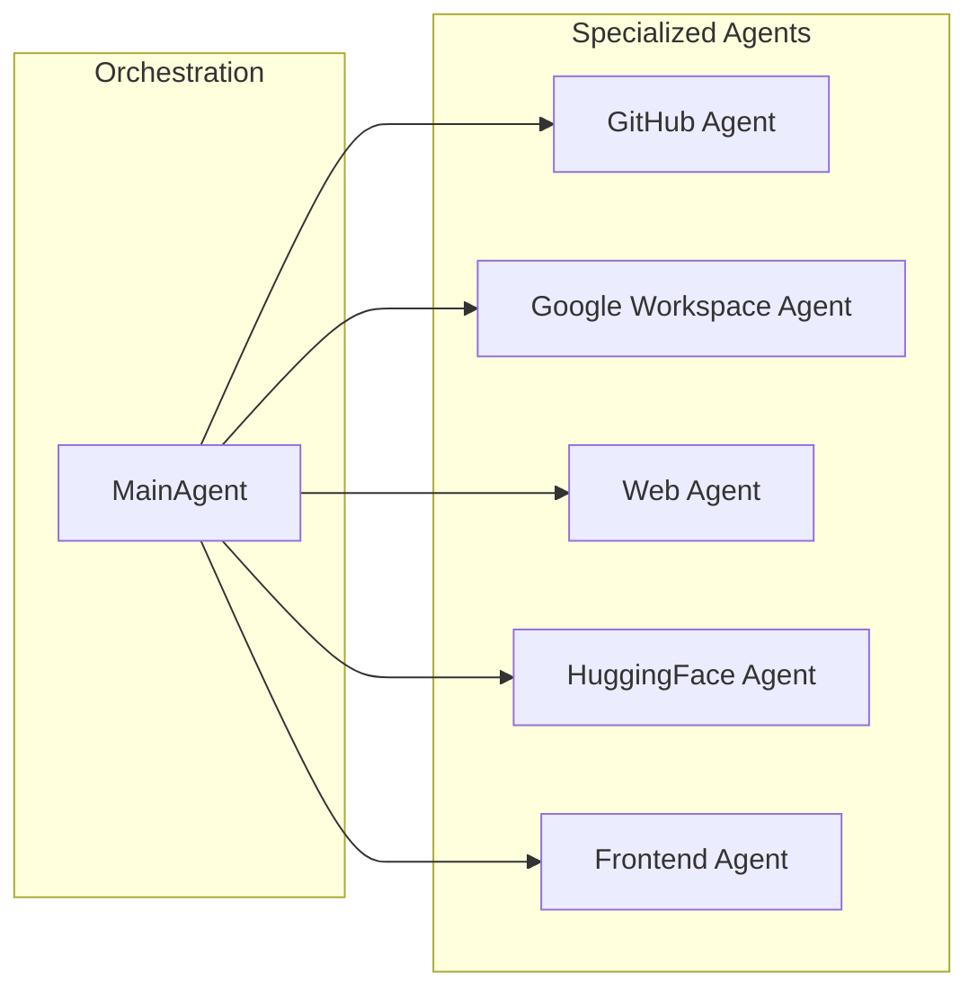

The Multi-Agent AI Framework provides specialized agents for different domains. The MainAgent orchestrates these agents, automatically routing requests based on user intent.

## Agent Hierarchy

## Available Agents

<CardGroup cols={2}>
  <Card title="Main Agent" icon="brain" href="/agents/main-agent">
    Orchestrator that coordinates all sub-agents and handles general queries
  </Card>
  <Card title="GitHub Agent" icon="github" href="/agents/github-agent">
    Repository management, issues, PRs, and code search
  </Card>
  <Card title="Google Workspace Agent" icon="google" href="/agents/google-workspace-agent">
    Gmail, Calendar, Drive, Docs, Sheets, and Slides integration
  </Card>
  <Card title="Web Agent" icon="globe" href="/agents/web-agent">
    Web page content extraction and metadata scraping
  </Card>
  <Card title="HuggingFace Agent" icon="face-smile" href="/agents/huggingface-agent">
    ML model, dataset, and research paper discovery
  </Card>
  <Card title="Frontend Agent" icon="palette" href="/agents/frontend-agent">
    UI theme and style customization via natural language
  </Card>
</CardGroup>

## How Delegation Works

1. **User Request**: User sends a message to the chat interface
2. **Intent Analysis**: MainAgent analyzes the request to determine the appropriate handler
3. **Delegation**: Request is routed to the specialized agent best suited for the task
4. **Execution**: The specialized agent uses its tools to complete the task
5. **Response**: Results are returned through MainAgent to the user

## Agent Capabilities Matrix

| Agent | Tools | MCP Server | Key Capabilities |
|-------|-------|------------|------------------|
| MainAgent | Delegation | - | Orchestration, general chat |
| GitHubAgent | 20+ | github-mcp | Repos, issues, PRs, search |
| GoogleWorkspaceAgent | 15+ | Google APIs | Email, calendar, files |
| WebAgent | 3 | firecrawl-mcp | Scrape, extract, parse |
| HuggingFaceAgent | 10+ | huggingface-mcp | Models, datasets, papers |
| FrontendAgent | 5 | - | Themes, colors, fonts |

<Note>
Each agent can be configured independently with different LLM providers and models. See [Agent Configuration](/configuration/agents).
</Note>
