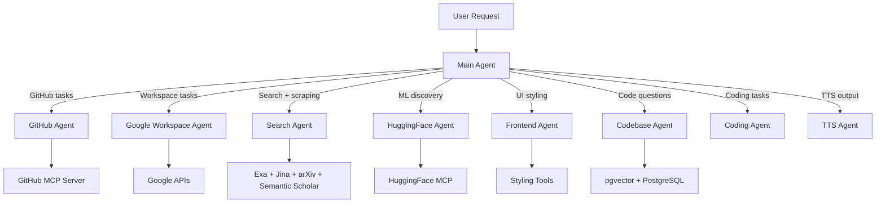

The Multi-Agent AI Framework uses a hierarchical orchestration pattern where a MainAgent coordinates specialized sub-agents to handle complex tasks.

## System Overview



## Core Components

### MainAgent (Orchestrator)

The MainAgent analyzes user requests and delegates to the appropriate specialized agent. It:

- Parses user intent to determine which agent should handle the request
- Maintains conversation context across agent switches
- Aggregates responses from sub-agents
- Handles tasks that don't require specialized capabilities

### Specialized Agents

Each agent is purpose-built for specific domains:

| Agent | Domain | MCP Server |
|-------|--------|------------|
| GitHubAgent | Repository management | github-mcp-server |
| GoogleWorkspaceAgent | Email, Calendar, Drive | Google APIs |
| SearchAgent | Web search + extraction | - |
| HuggingFaceAgent | ML model discovery | huggingface-mcp-server |
| FrontendAgent | UI customization | Internal tools |
| CodebaseAgent | Codebase analysis (RAG) | - |
| Coding Agent | Coding + refactoring | - |
| TTS Agent | TTS-friendly Turkish output | - |

### BaseAgent Class

All agents extend `BaseAgent`, which provides:

- LLM integration with multiple providers (Google, OpenAI, Anthropic, Groq)
- Tool execution framework
- Streaming response handling
- Error handling and retries

## Request Flow

<Steps>
  <Step title="User Input">
    User sends a chat message through the UI
  </Step>
  <Step title="API Route">
    `/api/chat` route receives the request and initializes MainAgent
  </Step>
  <Step title="Intent Analysis">
    MainAgent analyzes the request to determine routing
  </Step>
  <Step title="Agent Delegation">
    Request is delegated to the appropriate specialized agent
  </Step>
  <Step title="Tool Execution">
    Agent executes tools via MCP servers or internal functions
  </Step>
  <Step title="Response Streaming">
    Response is streamed back to the user interface
  </Step>
</Steps>

## Agent Configuration

Each agent has a configuration file defining:

```typescript
export const AgentConfig = {
  user_metadata: {
    id: "agent-id",
    name: "Agent Name",
    short_description: "Brief description",
    long_description: "Detailed description",
    icon: IconComponent,
    suggestedActions: ["Example action 1", "Example action 2"]
  },
  implementation_metadata: {
    type: "api",
    provider: "google",
    modelID: "gemini-2.5-flash",
    systemInstruction: agentSystemPrompt,
    apiKey: process.env.API_KEY
  }
}
```


## Directory Structure

```
lib/agents/
├── baseAgent.ts          # Base class for all agents
├── agentRegistry.ts      # Agent registration and lookup
├── configResolver.ts     # Configuration resolution
├── llmFactory.ts         # LLM provider factory
├── mainAgent/
│   ├── mainAgent.ts      # Orchestrator implementation
│   ├── config.ts         # Agent configuration
│   └── prompt.ts         # System prompt
├── codingAgent/
├── codebaseAgent/
├── githubAgent/
├── googleWorkspaceAgent/
├── huggingFaceAgent/
├── searchAgent/
├── frontendAgent/
└── ttsAgent/
```
